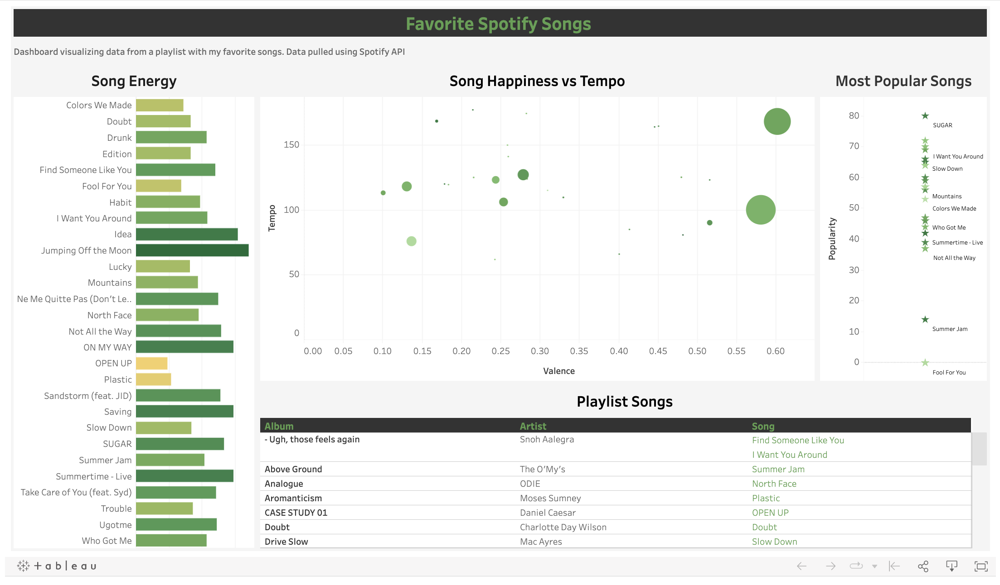

# autogluon_bike_sharing_prediction
 
This is a personal project I did to explore Spotify's API.

## Overview

This project sought to build help me gain familiarity with Spotify's API and understand some of my listening habits.  

## Methodology

A python script was written to pull listening habits + trends from one of my playlist, then the data was exported to a csv. From the csv I read the data into Tableau and created a visualization of the trends. 

## Dashboard 

Dashboard Link - [https://public.tableau.com/app/profile/bhoneywell/viz/SpotifySongAnalysis_16169005094160/FavoriteSpotifySongs](https://public.tableau.com/app/profile/bhoneywell/viz/SpotifySongAnalysis_16169005094160/FavoriteSpotifySongs)

## Documents
The documents contained in this repository are below: 

[Favorite Song Analysis](fav_song_analysis.py) - this file contains python code that pulls the songs in one of my Spotify playlist.

[Last Fifty Songs](last_fifty_songs.py) - this was an exploration script to pull my last fifty songs played. 

[Sort by Popularity](sort_by_popularity.py) - this file is similar to the first file except I sorted through one of Spotify's playlist to see the most popular songs. 

